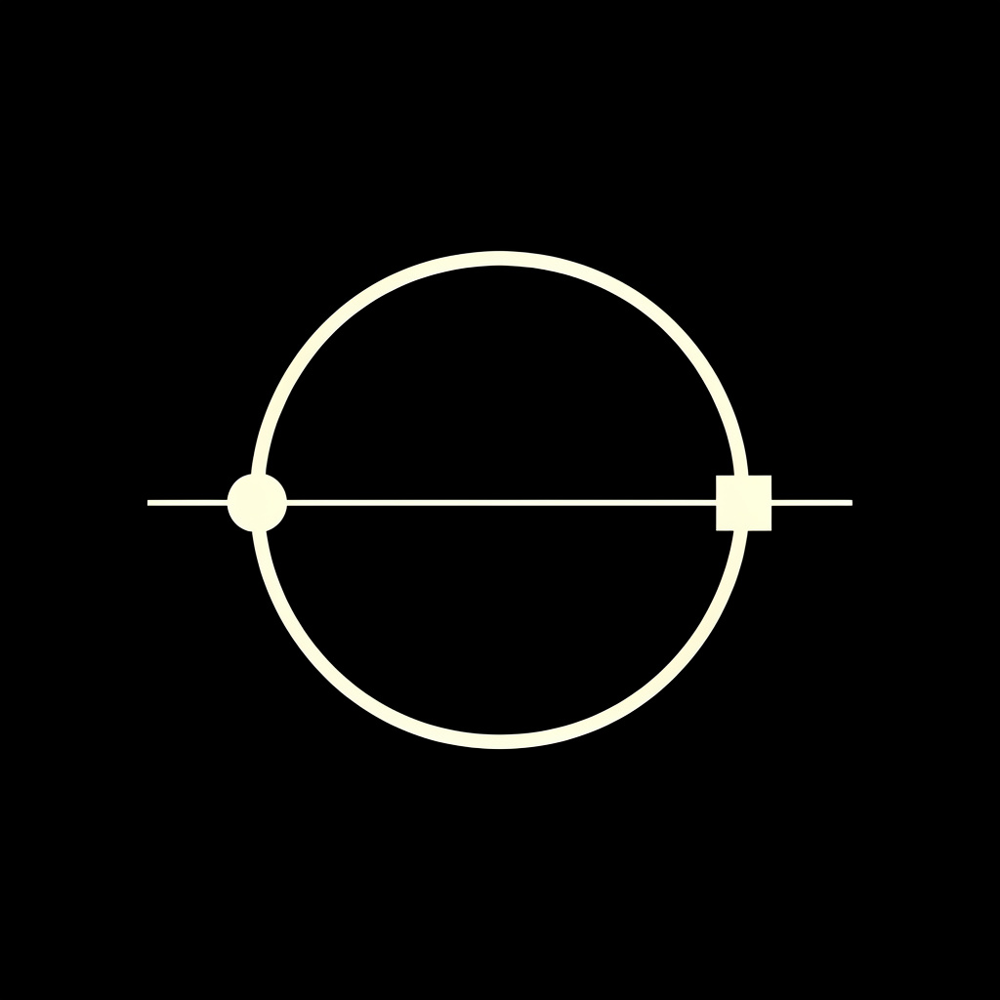
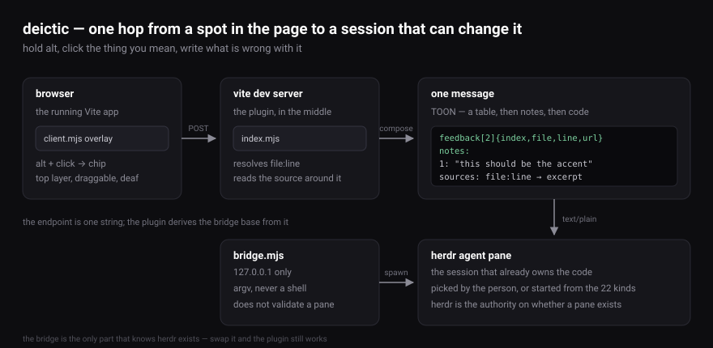
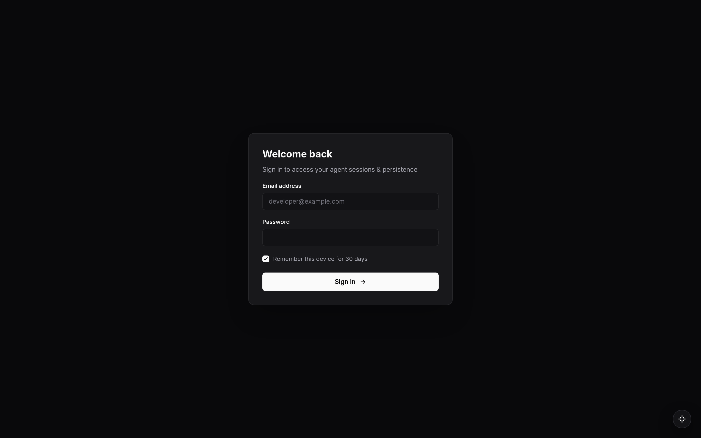
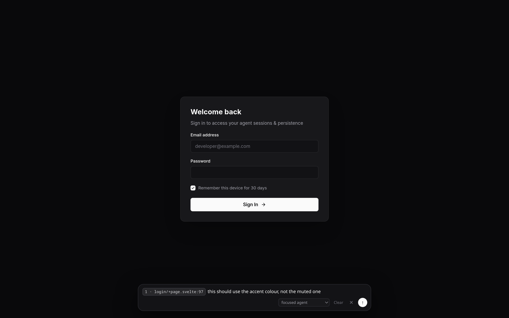
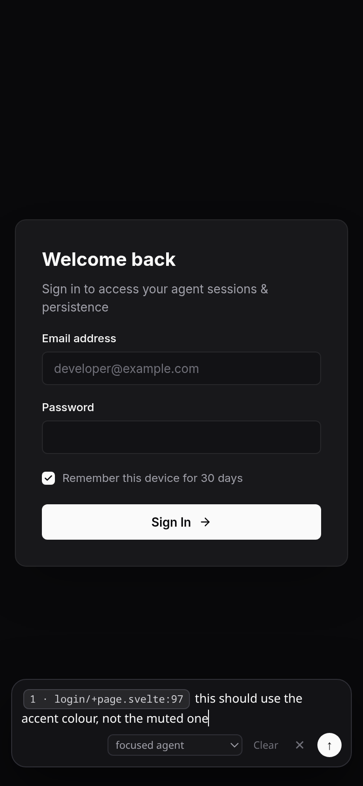

<p align="center">
  
</p>

# deictic

Point at the thing you mean instead of describing it. Hold <kbd>alt</kbd>, click any element in a running Vite app, write what is wrong with it, and a coding agent receives the source of the line that produced that element, the element itself, and a note in your words.

A deictic is a word like *here* or *that*: one whose meaning is fixed by the situation rather than by itself. That is the same gesture, in a browser.



At rest the tool is one circle in the corner, and the page is otherwise untouched:



Hold <kbd>alt</kbd> and click. The element you pointed at becomes a chip in the field, carrying the file and line it came from, and your note rides beside it:



The same walk at 390×844. The panel keeps the full width of a phone screen rather than the 660px it takes on a desktop:



## What the agent receives

The agent gets a table of every element you clicked, the file and line each one came from, the element described as the browser built it, and your words.

```toon
[ui feedback] 2 from 1 page(s)
request: the empty state should use the accent colour
feedback[1]{index,file,line,url}:
  2,apps/frontend/src/lib/Thread.svelte,158,/threads/9f2
notes:
  2: this should be the accent, not the muted foreground
context:
  2: button.rounded-md "Start a spec"
     aria-label: Start a spec
     path: body > div.flex > main > div.flex-col > button.rounded-md
     120×36 at 240,318
     padding 8px 12px · border-radius 6px · color #71717a
     from: Thread.svelte:158
sources:
  Thread.svelte:158
    157 |     <p class="text-sm text-muted-foreground">
    158 |     <button class="rounded-md px-3 py-2">Start a spec</button>
    159 |   </div>
```

The locations go in a [TOON](https://github.com/toon-format/toon) table because a table of locations is what TOON is for. The order is the order you clicked in, because a review reads as a walk through the app. The code is quoted as it is written, because quoting code as data makes it harder to read rather than smaller.

The `context` block is the half the file cannot supply. A file says what the code is; only the element says what the browser made of it: the tag, the id, the classes, the attributes that identify it, its text, a five-deep selector path, and the box and computed values the browser measured. A class is a claim and the computed value is the measurement, so a review that says "4px off" is arguing about the measurement.

## Install

```bash
npm install --save-dev deictic
```

```js
// vite.config.js
import { defineConfig } from 'vite';
import { feedbackPlugin } from 'deictic';

export default defineConfig({
  plugins: [feedbackPlugin({ endpoint: 'http://127.0.0.1:9977/prompt' })]
});
```

The plugin serves its own overlay, so nothing is imported into your app and nothing is added to your bundle.

## The code search is Svelte-only

`locate()` reads `__svelte_meta`, the location metadata Svelte's dev build attaches to each element. In a React, Vue or plain-DOM app no pick resolves to a file, so every note arrives as an element description with a selector path and no source excerpt. The pick still lands, because refusing it would lose the finding over a missing file path.

Supporting another framework means teaching `locate()` to read that framework's metadata. The rest of the tool is unaffected: the description, the notes and the walk are the same either way.

## How a note reaches an agent

The plugin is deliberately ignorant of the far end. It POSTs `text/plain` to the one `endpoint` you configured and reports whatever comes back, so anything that accepts a POST is a valid destination.

`bridge.mjs` is the herdr implementation, and the only file in this repository that knows herdr exists. It binds `127.0.0.1` and speaks four routes:

| route | behaviour |
| --- | --- |
| `GET /agents` | answers the running agents, the free panes and the 22 kinds that can be started |
| `POST /agent` | starts an agent of a chosen kind in a free pane and answers its pane id |
| `POST /prompt?target=<pane>` | runs `herdr agent prompt <pane> <text>`, and with no target uses the focused pane |
| `GET /health` | answers `{ok: true, target}` |

The overlay offers the running agents by name, with a "start new" group, and remembers the last choice. A bridge that is not running leaves the one option that always works, which is the focused agent.

## What the bridge decides

The bridge never validates a target pane. herdr is the authority on whether a pane id still exists, and quietly re-routing a stale pane to the focused one would send a note to an agent nobody picked, which is worse than an error. A refusal passes through as a refusal, with its own text and status.

The 22 agent kinds are a stated constant rather than a capability check, because herdr has no `agent kinds` command. Asking for a kind herdr does not have gets herdr's own refusal, which is the right way round: herdr is what would run it. The note travels as one argv element and never through a shell, so a note containing `$(...)` or a quote cannot execute anything.

## What the overlay does in the browser

A closed popover is `display: none` from the user agent stylesheet, so the overlay adds and removes the `popover` attribute rather than toggling it. An inline `display` would beat the user agent sheet and leave the node drawn while it is shut. The overlay is lifted into the top layer unconditionally, launcher included, because a circle a modal covers is a tool that cannot be brought back.

A drag is not a click. The browser sends a `click` after every `pointerup`, so a press that moves more than 4px is recorded as a drag and the click it drags out with is swallowed. Without that, moving the circle to a corner also opened the panel.

While <kbd>alt</kbd> is held, the overlay swallows `pointerup`, `wheel`, `contextmenu`, `dblclick` and `touchstart` at the window in the capture phase, so the app sees nothing. It deliberately does not swallow `mousedown` and `click`, because the picker has to see those to turn them into a pick, and a window-level capture that took them first would break picking outright.

## Tests

```bash
bun test
```

60 tests across the three modules. The plugin has a Vite peer dependency and no runtime dependencies; the bridge is `node:child_process` and an HTTP server. jsdom is the only devDependency.

| file | role |
| --- | --- |
| `index.mjs` | the Vite plugin: routes, file and line resolution, message composition |
| `client.mjs` | the overlay: picking, the note field, the agent picker |
| `toon.mjs` | the batch format |
| `bridge.mjs` | the herdr side, and the only herdr-aware file |

## License

MIT

---

Built with Bun, Vite and jsdom. Written with an AI coding agent running `openrouter/stealth/space-bunny-alpha`.
